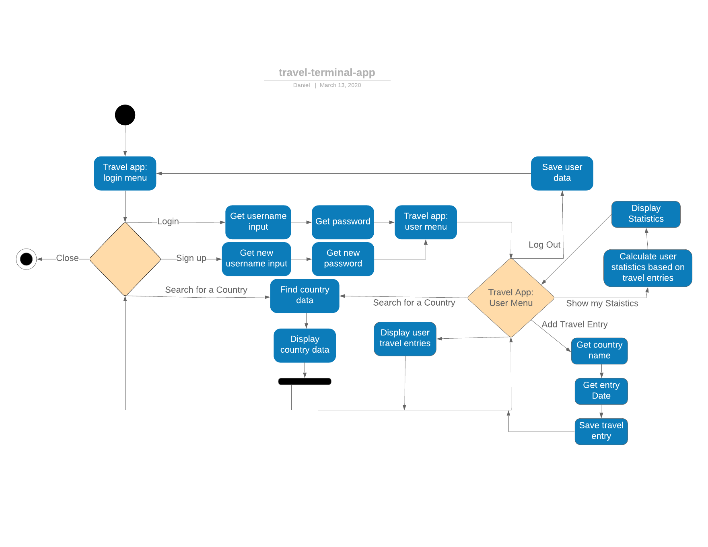

# DanielTerminalApp

Welcome to your new gem! In this directory, you'll find the files you need to be able to package up your Ruby library into a gem. Put your Ruby code in the file `lib/daniel_terminal_app`. To experiment with that code, run `bin/console` for an interactive prompt.

TODO: Delete this and the text above, and describe your gem

## Installation

Add this line to your application's Gemfile:

```ruby
gem 'daniel_terminal_app'
```

And then execute:

    $ bundle install

Or install it yourself as:

    $ gem install daniel_terminal_app

## Usage

TODO: Write usage instructions here

## Development

After checking out the repo, run `bin/setup` to install dependencies. Then, run `rake spec` to run the tests. You can also run `bin/console` for an interactive prompt that will allow you to experiment.

To install this gem onto your local machine, run `bundle exec rake install`. To release a new version, update the version number in `version.rb`, and then run `bundle exec rake release`, which will create a git tag for the version, push git commits and tags, and push the `.gem` file to [rubygems.org](https://rubygems.org).

## Contributing

Bug reports and pull requests are welcome on GitHub at https://github.com/[USERNAME]/daniel_terminal_app.

# Travel Terminal App

## Source

https://github.com/cDask/daniel_terminal_app

## Project Objective and Scope

This app will allow users to track the countries they visited and make journal entries about their experiences as well as be able to provide some basic information about the countries. It will allow users to create, read, update and delete travel entries as well as country entries. The data should be persistant so as to able to save data between sessions. This app will be a basic organisational app that should allow people to store travel entries as well as track some basic travel statistics. As a big traveller myself I'm creating this app so that I can easily look up how many countries I've visited and keep track how many countries I still have left to see in different continents. The target audience would be anyone willing to use this app but mainly for those who are interested in travelling as well as statistics. The terminal app will work directly from the terminal where output and input and handled directly through the terminal.

## Feature Set

### User

The app will need to distinguish between different users each user having their own personal list of travel entries. All users will require a username and a password although password will be placeholder and use no encryption. All of this data must be persistant meaning it will be saved between sessions of the app. The way this will be implemented is through the use of JSON files.

### Countries info

The app should hold a database of most countries in a persistant JSON file. The app will read this data and be able to display it in a nice legible format. Some must have data will be country name, capital, currency, phone extension and region/countinent.

### User statistics

Based on the two features above the app will be able to show some travel statistics of the each user. The main statistic will be the number of unique countries they visited in the world and the number of unique countries they visited in each region.

### Menu system

The app is required to have an easy navigable menu system allows user to easily log in, sign up, search countries or close the app. Once logged in they must be able to add travel entries, search for countries, see their travel statistics, see their travel entries and log out from their account.

## App Outline

The way users will find out how to use the app should be pretty intuitive. To install the app they should refer to this README file and follow the instructions below under the 'Install Instructions Heading'. Once in the app, prompts and small instructions will be provided that hopefully should be sufficiently self explanatory to guide the user through the menus and features.

Inputs and user interaction with be handled by the tty-prompt. Most inputs will be typed into terminal and then submitted through the use of the return key. All menu will be navigated through the use of the arrow keys and then the return key to use that feature.

All errors or incorrect inputs will prompt the user with an error message and then returning them to a previous menu or in certain cases ask them to enter a new valid input.

## Implementation Plan

Below 
## UML Diagram



## Install Instruction


