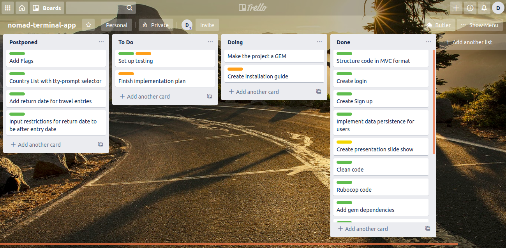

# Travel Terminal App

## Source

https://github.com/cDask/daniel_terminal_app

## Project Objective and Scope

This app will allow users to track the countries they visited by making log entries about countries they've visited as well be able to provide some basic information about the countries of the world. It will allow users to create and read travel entries they've made. The data should be persistant betweeen sessions of the app. 

This app should mainly be used as a basic organisational tool that should allow people to store travel entries as well as track some basic travel statistics. It can also be used as a quick reference, allowing users to look up country information. 

As a big traveller myself I'm creating this app so that I can easily look up how many countries I've visited and keep track of how many countries I still have left to see in different continents. The target audience would be anyone willing to use this app but mainly for those who are interested in travelling as well as statistics. The terminal app will work directly from the terminal where output and input are handled directly through the terminal.

## Feature Set

### 1. Users

The app will need to distinguish between different users making sure that each user having their own independant personal list of travel entries. All users will require a username and a password although password will be placeholder and use no encryption or security. All of this data must be persistant meaning it will be saved between sessions of the app. The way this will be implemented is through the use of JSON files.

### 2. Countries information

The app should hold a database of most countries in a persistant JSON file. The app will read this data and be able to display it in a nice legible format. Some important data that will be included are country name, capital, currency, phone extension and region/continent.

### 3. User statistics

Based on the two features above the app will be able to show some travel statistics of the each user. The main statistic will be the number of unique countries they visited in the world and the number of unique countries they visited in each region.

### 4. Menu system

The app is required to have an easy navigable menu system that allows user to easily log in, sign up, search countries or close the app. Once logged in they must be able to add travel entries, search for countries, see their travel statistics, see their travel entries and log out from their account.


## App Outline

The way users will find out how to use the app should be pretty intuitive. To install the app they should refer to this README file and follow the instructions below under the 'Installation Heading'. Once in the app, prompts and small instructions will be provided that hopefully should be sufficiently self explanatory to guide the user through the menus and features.

Inputs and user interaction with be handled by the tty-prompt. Most inputs will be typed into terminal and then submitted through the use of the return key. All menu will be navigated through the use of the arrow keys and then the return key to use that feature.

All errors or incorrect inputs will prompt the user with an error message and then returning them to a previous menu or in certain cases ask them to enter a new valid input.

## Implementation Plan

To organise my implementation tasks I used trello. Below is a screenshot of my trello part way through the project. To see the final board I've added the Trello link below.



Trello board link:
https://trello.com/b/p1XRA23m/travel-terminal-app

## UML Diagram


## Installation

### Linux
    
#### Git

First you will need to install git.

First, use the apt package management tools to update your local package index. With the update complete, you can download and install Git:

    sudo apt update
    sudo apt install git

You can confirm that you have installed Git correctly by running the following command:

    git --version

Output

    git version 2.17.1

ow that you have Git installed, you should configure it so that the generated commit messages will contain your correct information.

This can be achieved by using the git config command. Specifically, we need to provide our name and email address because Git embeds this information into each commit we do. We can go ahead and add this information by typing:

    git config --global user.name "Your Name"
    git config --global user.email "youremail@domain.com"

We can see all of the configuration items that have been set by typing:

    git config --list

Output
user.name=Your Name
user.email=youremail@domain.com
...

The information you enter is stored in your Git configuration file, which you can optionally edit by hand with a text editor like this:

    nano ~/.gitconfig

~/.gitconfig contents

[user]
  name = Your Name
  email = youremail@domain.com

There are many other options that you can set, but these are the two essential ones needed. If you skip this step, you’ll likely see warnings when you commit to Git. This makes more work for you because you will then have to revise the commits you have done with the corrected information.


There are some configurations that we need to perform before going further as well.

Run the following commands in terminal

    git config --global color.us true

    git config --global user.name "YOUR NAME"

Replace YOUR NAME with your actual name

    git config --global user.email "YOUR@EMAIL.com"

Replace YOUR@EMAIL.com with your actual email address

You only need to do this configuration once.


rbenv

Follow this guide to install rbenv.

Please only follow the guide up to the end of Step 1.

    Ruby

rbenv install 2.7.0

This will install a version of Ruby on your local machine.

To actually use 2.7.0 globally on your machine you need to run:

rbenv global 2.7.0

Run the following command in terminal:

ruby --version 

If you see 2.7.0 you’re good to go.

Add this line to your application's Gemfile:

```ruby
gem 'daniel_terminal_app'
```

And then execute:

    $ bundle install

Or install it yourself as:

    $ gem install daniel_terminal_app

## Usage

To run the gem you need to open irb.

    $ irb

Once in irb enter:

    irb(main):001:0>require 'daniel_terminal_app'

This should launch the application and it should be ready to use.
To navigate the app all you have to do is used the arrow keys to select menu options and type in input to the terminal when prompted.

## Testing

All testing was done manually but should be automated for future projects. The link below will take you to a google sheet with all the test.

https://docs.google.com/spreadsheets/d/1ZtUioG1ANQXNkF1SdVhGrC1zhpo2_VRq6Gf6T3W1p3s/edit?usp=sharing


## Development

After checking out the repo, run `bin/setup` to install dependencies. Then, run `rake spec` to run the tests. You can also run `bin/console` for an interactive prompt that will allow you to experiment.

To install this gem onto your local machine, run `bundle exec rake install`. To release a new version, update the version number in `version.rb`, and then run `bundle exec rake release`, which will create a git tag for the version, push git commits and tags, and push the `.gem` file to [rubygems.org](https://rubygems.org).

## Contributing

Bug reports and pull requests are welcome on GitHub at https://github.com/cDask/daniel_terminal_app.


